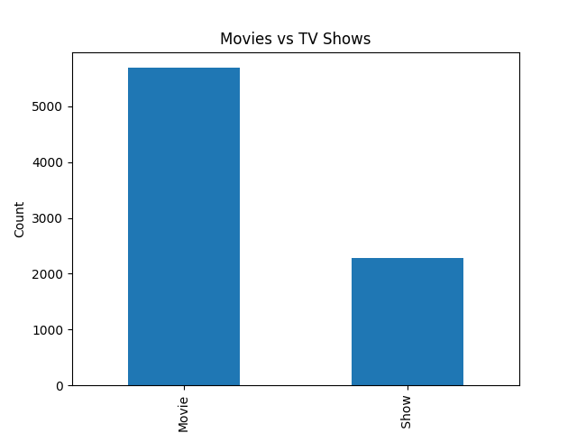

# Netflix Data Analysis (Python)

This project is a beginner-level data analysis performed using Python to explore and understand content trends in the Netflix dataset.

---

## 📁 Dataset

The dataset used in this project is sourced from Kaggle and contains information about movies and TV shows available on Netflix.

---

## 📊 Project Objectives

* Analyze the distribution of Movies vs TV Shows
* Identify top countries producing Netflix content
* Explore most popular genres
* Visualize key insights using a bar chart

---

## 🛠️ Tools & Technologies

* Python
* Pandas
* Matplotlib

---

## 📈 Key Insights

* Netflix has significantly more **movies** than TV shows
* The **United States and India** contribute the most content
* Popular genres include **Documentaries and Dramas**

---

## 📷 Output Visualization



---

## ▶️ How to Run

1. Install required libraries:

   ```
   pip install pandas matplotlib
   ```
2. Run the script:

   ```
   python netflix_analysis.py
   ```

---

## 📌 Conclusion

This project demonstrates basic data analysis skills using Python, including data exploration, insight generation, and simple visualization.

---

## 🔗 Author

**Rakesh Dabbikar**

LinkedIn: https://linkedin.com/in/rakeshdabbikar


